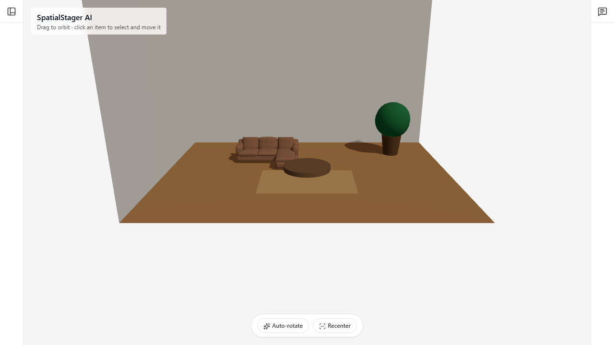
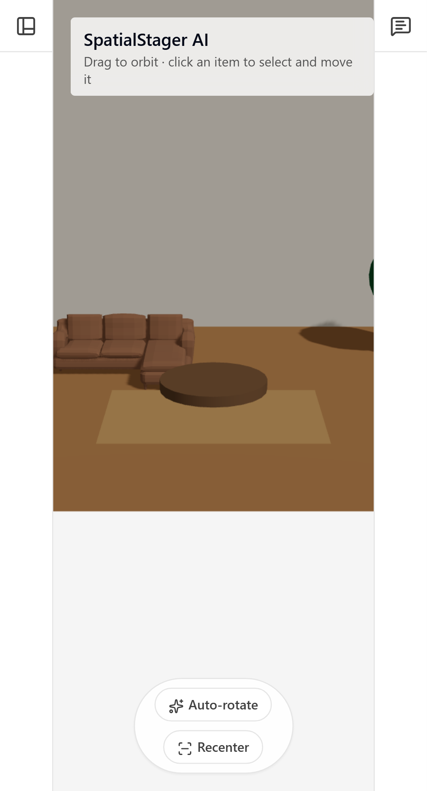

# SpatialStager AI

> AI-assisted 3D room staging for trying layouts, materials, and lighting before committing to a design.

https://capstone-project-three-silk-20.vercel.app

**Repository:** [github.com/ahmadali777/capstone-project](https://github.com/ahmadali777/capstone-project)

SpatialStager AI is a browser-based interior-design playground. Users can place and reposition furniture in a 3D room, adjust materials and lighting, upload a room photo for a quick style suggestion, and ask an AI design assistant for tailored advice. Designs remain in the browser and can be exported as JSON or a PNG image.

## Screenshots

The desktop and mobile views below were captured from the local application. Keeping the source images in the repository lets the README render on GitHub and gives reviewers an immediate view of the product.

| 3D room designer | Responsive controls |
| --- | --- |
|  |  |

## What it does

- Creates an interactive 3D room with orbit controls and a client-only Three.js canvas.
- Adds, selects, rotates, recolours, and drags floor furniture (sofa, chair, table, lamp, plant, and rug).
- Adds wall-mounted doors, windows, and vents, with placement on the back or left wall.
- Highlights colliding floor furniture and shows a warning instead of blocking the layout; rugs are excluded from collision checks.
- Adjusts wall colour, floor finish, lighting, room dimensions, and furniture finishes.
- Supports undo/redo for layout changes.
- Saves the current design to `localStorage`, exports/imports layout JSON, and downloads a PNG screenshot of the canvas.
- Accepts a room photo and returns a demo style suggestion that can be applied to the scene.
- Streams AI-powered interior-design advice through the chat panel when a Groq or OpenRouter key is configured.
- Falls back to a static SVG room preview for WebGL-unavailable, low-power, or reduced-motion environments.

## Tech stack

| Area | Tools |
| --- | --- |
| App framework | Next.js 14 (App Router), React 18, TypeScript |
| 3D scene | Three.js, React Three Fiber, React Three Drei |
| Styling and UI | Tailwind CSS, Radix UI, Lucide |
| State | Zustand with Zundo history |
| AI chat | Groq SDK or OpenRouter, Vercel AI SDK streaming primitives |
| Validation and forms | Zod, React Hook Form |
| Testing | Vitest, Testing Library, Playwright |
| Deployment target | Vercel |

## Run locally

### Prerequisites

- Node.js 18.17 or newer (Node 20 LTS recommended)
- npm
- An optional Groq or OpenRouter API key for live chat

### Setup

```bash
git clone https://github.com/ahmadali777/capstone-project.git
cd capstone-project
npm install
```

Create `.env.local` in the project root. Configure at least one chat provider if you want live responses:

```env
GROQ_API_KEY=your_groq_key
# Or use OpenRouter:
# OPENROUTER_API_KEY=your_openrouter_key
```

Start the app:

```bash
npm run dev
```

Open [http://127.0.0.1:3000](http://127.0.0.1:3000). The room designer and mock photo-analysis flow work without an API key; the chat panel explains how to configure a key when neither provider is available.

### Useful commands

```bash
npm run dev        # local development server
npm run build      # production build check
npm run start      # serve a completed production build
npm test           # unit/component tests
npm run test:e2e   # Playwright browser tests
```

## Environment variables

| Variable | Required | Used by | Purpose |
| --- | --- | --- | --- |
| `GROQ_API_KEY` | No* | `/api/scene-chat` | Preferred provider for streamed design chat (`openai/gpt-oss-120b`). |
| `OPENROUTER_API_KEY` | No* | `/api/scene-chat` | Alternative provider for streamed design chat (`openai/gpt-4o-mini`). |
| `GEMINI_API_KEY` | No* | `/api/scene-chat` | Backward-compatible fallback alias for the OpenRouter key. |
| `OPENAI_API_KEY` | No | commented example in `/api/analyze-room` | Only needed if the mock photo-analysis implementation is intentionally replaced with the documented OpenAI example. |

\* Configure either `GROQ_API_KEY` or `OPENROUTER_API_KEY` for live AI chat. Never prefix these variables with `NEXT_PUBLIC_`, commit `.env.local`, or expose API keys in the browser.

## Architecture

```text
Browser
├── app/page.tsx
│   ├── ToolsPanel: room, material, object, import/export controls
│   ├── Scene: lazy-loaded React Three Fiber room and furniture
│   └── ChatPanel: streamed conversation UI
├── Zustand store
│   ├── scene state, collision checks, undo/redo
│   └── localStorage autosave/restore
└── Next.js route handlers
    ├── POST /api/analyze-room → deterministic demo style suggestion
    └── POST /api/scene-chat → Groq or OpenRouter → streamed response
```

The 3D scene is dynamically imported with server-side rendering disabled because WebGL requires the browser. Scene state is intentionally client-local: there are no accounts, databases, or server-side saved designs in this version. API keys are read only in the server route handler, so the browser never receives them.

## Product and engineering decisions

- **Interactive 3D instead of generated images:** staging objects in a scene lets users experiment with placement, collisions, materials, and lighting rather than receiving a single static output.
- **Progressive enhancement for rendering:** the application preserves the core room experience with an SVG fallback when WebGL or motion-heavy rendering is unsuitable.
- **Local-first saving:** `localStorage` and JSON import/export keep the first version simple, private, and usable without sign-in or backend infrastructure.
- **Soft collision feedback:** a warning is more useful for exploratory staging than a hard placement restriction; designers can deliberately overlap items while experimenting.
- **Provider fallback for chat:** the route prefers Groq when available and otherwise uses OpenRouter, reducing coupling to one AI service.
- **Mock image analysis in v1:** photo analysis returns sample style suggestions, allowing a complete demo without requiring image-model credits. The route contains a documented OpenAI implementation path for a future live version.

## Production deployment and API safety

Deploy by importing the GitHub repository into Vercel. Add `GROQ_API_KEY` or `OPENROUTER_API_KEY` in **Project Settings → Environment Variables** for Production, Preview, and Development as appropriate, then redeploy. A custom domain can be connected from Vercel’s Domains settings.

Before publishing publicly, complete this production checklist:

- [ ] Add the Vercel production URL at the top of this README.
- [ ] Set the required provider key in Vercel; confirm no keys appear in client-side bundles or Git history.
- [ ] Add an IP-based rate limit to `/api/scene-chat` (for example, with Vercel KV/Upstash) and return `429` with a `Retry-After` header when exceeded.
- [ ] Cap request size, number of messages, and message length before calling the provider.
- [ ] Set a sensible `maxDuration` on the streaming route for the chosen Vercel plan.
- [ ] Test the full flow in Chrome, Firefox, Safari, and mobile Safari.

**Current limitation:** the chat handler caps provider output (`600` tokens) and only sends the latest user message, but it does. implement an application-level rate limit, input-size cap, or `maxDuration`.

## How AI tools contributed

AI tools were used as a development collaborator, not as an unattended code generator. They helped with:

- breaking down the capstone scope into the 3D staging, persistence, chat, accessibility, and testable UI pieces;
- drafting and refining React/TypeScript patterns for scene controls, Zustand state transitions, and streamed chat handling;
- suggesting test cases and accessibility improvements, with the resulting work checked through Vitest and Playwright;
- reviewing and improving documentation language, including this README.

All project-specific implementation choices—such as the local-first design model, collision behaviour, WebGL fallback, API provider order, and final code integration—were reviewed and made by the project author. AI output was treated as a starting point and verified in the application.

Built by:
Muhammad Ahmad Ali
https://ahmad-swe-portfolio.vercel.app

## License

This project is licensed under the [MIT License](LICENSE).
